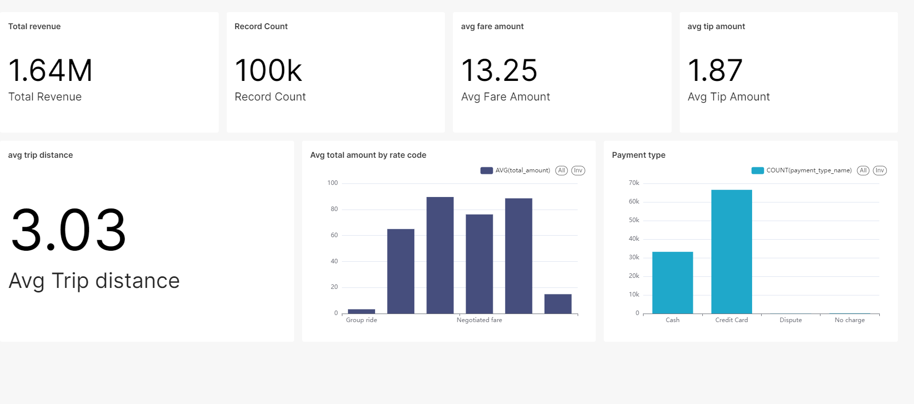

# Uber Data Analytics project
##  Technical using in this project:
- Python
- Pyspark
- PostgreSQL
- Superset
- OS: Window(WSL 2)
- Hadoop: HDFS

## Demo
1. step: data ingestion

2. step: data transformation

3. step: load transformed data to data warehouse

## Demo analytics

